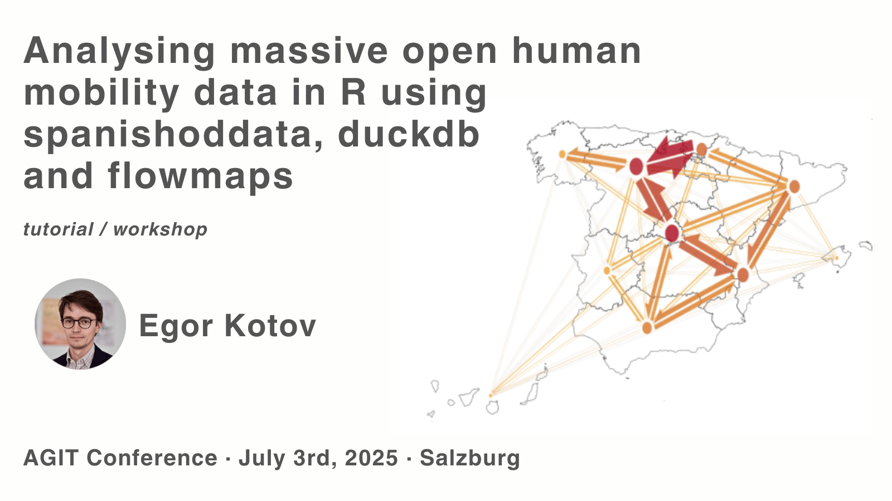

This repository contains the source code (in main branch) and compiled website (in gh-pages branch) for the workshop and tutorial "Analysing massive open human mobility data in R using spanishoddata, duckdb and flowmaps" workshop at AGIT 2025 conference [https://agit.at/en/](https://agit.at/en/) in Salzburg.

The website with the workshop materials and slides is available at: [https://www.ekotov.pro/agit-2025-spanishoddata](https://www.ekotov.pro/agit-2025-spanishoddata)
